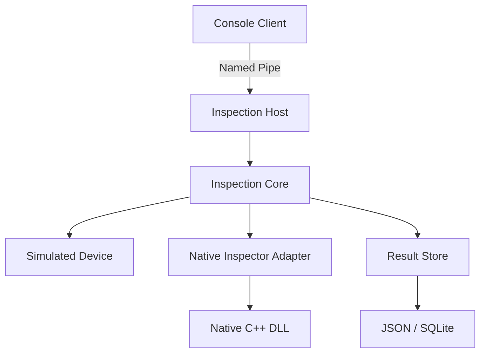
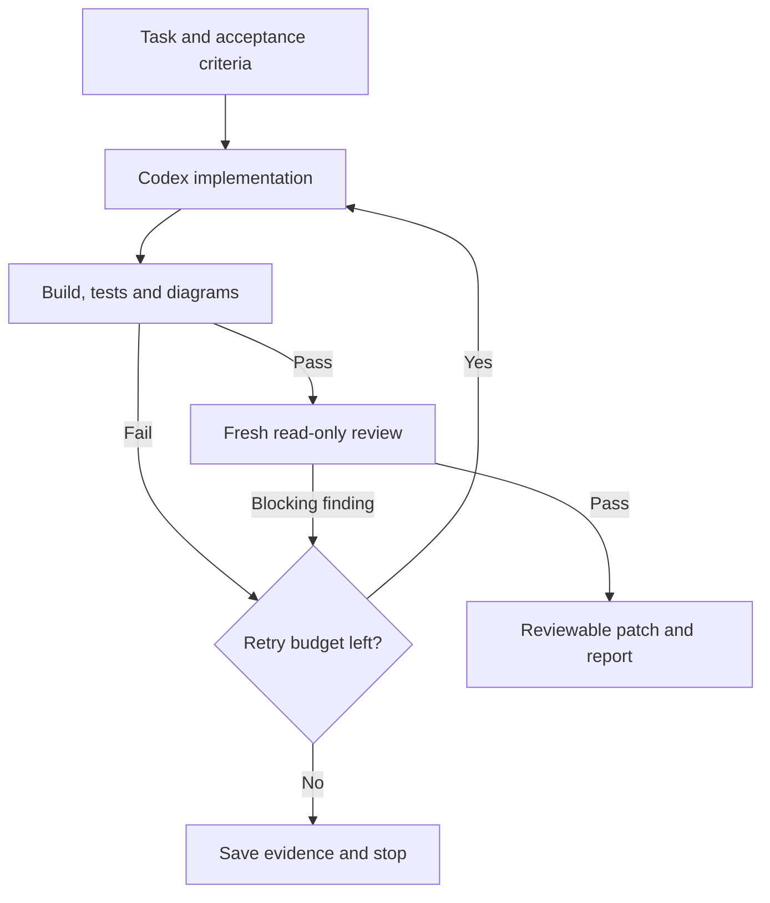

# InspectionLab — 아키텍처와 Codex 개발 루프 제안

작성일: 2026-09-26. 구현 착수: 2026-09-27. 이 문서는 전체 단계의 설계이며, 현재 구현 범위는 M6까지다. 현재 코드의 계약은 [아키텍처](docs/architecture.md), [Native ABI](docs/native-interop.md), [Engine 계약](docs/engine-contract.md), [IPC 계약](docs/ipc-contract.md), [저장·진단](docs/storage-diagnostics.md), [C++/CLI 비교](docs/cpp-cli-comparison.md)에 있다. 실제 증거는 [M1 기록](docs/practice-M01.md), [M2 기록](docs/practice-M02.md), [M3a 기록](docs/practice-M03a.md), [M3b 기록](docs/practice-M03b.md), [M3c 기록](docs/practice-M03c.md), [M4 기록](docs/practice-M04.md), [M5 기록](docs/practice-M05.md), [M6 기록](docs/practice-M06.md)에서 구분한다. Codex 자동 반복 제어기와 도구 이전은 별도 후속 계획이다. 기존 학습 진도를 구현 완료로 변경하지 않는다.

## 1. 목표와 근거

가상 검사 장비의 Non-UI 실행 엔진을 만든다. Job 정의, 수동·자동 실행, C++ 검사 모듈, IPC, 결과 저장·조회, 오류·취소·종료를 연결한다. 실제 회사의 장비나 알고리즘을 재현하지 않는다.

첨부 01-C-Core(1).md, 02-Learning-Status(2).md와 채용 포지션을 확인했다. 최신 진도는 26회차 개념·핵심 답변 확인 완료이며 실제 통합 실습은 미완료다. 이번 설계는 기존 로드맵의 실습을 구체화한다.

참고 저장소: https://github.com/Myoungmin/CPP-DesignPatterns

확인 커밋: `46643f6af3f86acbe014070ae9763daf96a3e1b6`.

직접 읽은 파일: AGENTS.md, README.md, docs/documentation-rules.md, docs/diagram-guide.md, scripts/build-docs.ps1.

기존 방식은 AI가 설계 변경 영향을 판단하여 PlantUML을 갱신하고 PowerShell로 SVG를 렌더링하는 구조다. 코드에서 전체 구조를 추출하는 분석기나 변경 감시 루프는 확인한 구성에 없다. 이 문서에서는 기존 문서 운영 방식을 이어가고 결정적인 검사와 반복 제어를 추가한다. 첨부 image.png는 제공 경로에 없어 확인하지 못했다.

## 2. 최종 사용 시나리오

1. 콘솔 클라이언트가 Job을 등록하고 실행을 요청한다.
2. Host가 요청을 검증하고 실행 ID를 반환한다.
3. Core가 가상 장비를 준비하고 측정 데이터를 취득한다.
4. Native 검사기가 숫자 배열을 검사해 점수와 불량 개수를 반환한다.
5. Core가 결과를 저장하고 조회 가능한 완료 상태로 전환한다.
6. 클라이언트가 상태·결과를 조회하거나 실행을 취소한다.

Job은 처음에는 `Prepare → Acquire → Inspect → Persist`의 고정 순서다. 첫 버전부터 범용 workflow 언어, 플러그인 검색, 분기 그래프를 만들지 않는다. 실제로 단계 변경이 필요해질 때 IInspectionStep을 도입한다.

## 3. 최종 프로젝트 구조

| 프로젝트 | 책임 | 허용 의존성 |
| --- | --- | --- |
| Inspection.Core | Job, 실행 제어, 상태, 결과, 외부 기능 인터페이스 | BCL; 다른 프로젝트 참조 없음 |
| Inspection.Infrastructure | 가상 장비, C# 검사기, 파일/SQLite 저장 구현 | Core, Microsoft.Data.Sqlite |
| Inspection.Interop | LibraryImport, SafeHandle, Native 오류·콜백 변환 | Core, Native DLL 런타임 호출 |
| Inspection.CppCli | C++/CLI IInspector, 직접 C++ 호출과 공유 관리 수명 연결 | Core, Interop, Native import library |
| Inspection.Contracts | IPC 요청·응답 DTO, 프로토콜 버전·오류 코드 | BCL |
| Inspection.Host | 실행 프로세스, 인스턴스 조립, IPC 서버, 종료 | Core, Infrastructure, Interop, Contracts, 사전 빌드된 CppCli 파일 참조 |
| Inspection.Client | 별도 콘솔 클라이언트 | Contracts |
| NativeInspection | C ABI를 노출하는 C++ 가상 검사 DLL | C++ 표준 라이브러리 |
| Inspection.Tests | MSTest 단위 테스트와 직접 만든 테스트 대역 | Core |
| Inspection.IntegrationTests | 실제 DLL·파일·IPC 통합 검증 | 실제 어댑터와 Host |

Core는 Host, IPC DTO, 저장 구현, P/Invoke 선언을 참조하지 않는다. Host는 생성과 종료를 책임지는 조립 지점이다. 최초에는 생성자 주입으로 직접 연결하고, 실행·종료 구성이 커질 때 Generic Host/DI 컨테이너를 도입한다.

Core의 시작 타입은 InspectionJob, InspectionResult, InspectionRunner, IDevice, IInspector, IResultStore 정도다. Job 정의 ID와 개별 실행의 RunId를 분리한다. 외부에서 받은 Job 정의는 검증 후 실행용 불변 스냅샷으로 만든다.

### 실행 시 연결

위 그림은 실행 시 호출 관계다. 빌드 의존성에서는 Infrastructure와 Interop이 Core의 인터페이스를 구현하기 위해 Core를 참조한다. 두 방향을 한 그림에서 혼동하지 않는다.

## 4. 기술 선택 제안

| 항목 | 제안 | 이유 |
| --- | --- | --- |
| 환경 | Windows x64, VS 2022 17.14, .NET SDK 9.0.305 / net9.0 | 사용자 선택에 따라 현재 환경으로 시작; .NET 10 전환은 별도 작업 |
| 테스트 | MSTest | 기존 학습과 일관성 유지 |
| Native 연동 | C ABI + LibraryImport 먼저 | 호출 경계와 데이터·수명 계약을 직접 검증 |
| C++/CLI | 후반에 IInspector의 교체 구현으로 추가 | 같은 동작 계약을 두 방식으로 비교 |
| IPC | Named Pipe + 길이 헤더 + UTF-8 JSON | 로컬 두 프로세스 사이의 프로토콜 실습 |
| 저장 | 실행별 JSON 파일 → SQLite | 최초 실행을 단순하게 만들고 조회를 확장 |
| 문서 | PlantUML + SVG | 참고 저장소 운영 방식 유지 |
| 반복 실행 | PowerShell 제어 스크립트 + Codex CLI | Windows 빌드와 함께 단계별 결과를 제어 |

global.json과 패키지 잠금 파일로 초기 버전을 고정한다. 2026-09-29 사용자 요청으로 .NET 10 전환은 필요 시까지 보류한다. 새 기능·패키지·IDE 호환성 요구나 실제 배포의 지원 정책을 검토할 때 [B01](docs/backlog.md)의 조건에 따라 별도 전환 작업을 시작한다. 관리 프로젝트는 dotnet build/test, Native 프로젝트는 MSVC vcxproj와 MSBuild로 구분한다. M6에서 실제 C++/CLI Release/Debug 빌드·배포를 확인했다. 현재는 build-cppcli.ps1이 Native → Core/Interop → C++/CLI 순서를 수행하고 Host/테스트는 그 뒤 dotnet으로 빌드한다.

## 5. 먼저 고정할 동작 계약

### 수동·자동 실행과 동시성

- 수동 실행은 Job 한 건, 자동 실행은 같은 실행기를 통한 순차 반복이다.
- 동시에 장비를 사용하는 실행은 하나다. 초기에는 중복 시작을 Busy로 거절한다. 큐는 요구가 생긴 후 추가한다.
- 자동 실행 중 외부 수동 장비 명령도 동일한 배타 정책을 적용한다.
- 자동 실행 예약, 현재 상태 확인, 실행 등록은 같은 동기화 규칙으로 보호한다.
- StopAuto는 다음 Job 예약을 중지하고, 현재 Job 취소는 CancelRun으로 요청한다. 자동 반복은 제품 Fail에는 계속하고 실행 오류·타임아웃·현재 실행 취소에는 중지한다.
- 장비에 부작용이 있는 명령은 자동 재시도하지 않는다. 조회처럼 안전한 작업부터 재시도를 도입한다.

### 상태와 결과

- 현재 실행 상태: Running, Persisting, CancelRequested, Succeeded, Canceled, TimedOut, Faulted. 큐가 없는 현재 버전에는 Queued를 두지 않는다.
- 엔진 수명: Ready, Stopping, Faulted, Disposed. 수동/자동은 별도 모드다.
- 제품 판정: Pass/Fail. 불량 판정 Fail은 검사 실행 실패 Faulted와 다르다.
- 저장 실패는 성공으로 보고하지 않는다. 계산 결과와 저장 상태를 구분해 진단 가능하게 남긴다.
- 초기 성공 계약은 검사와 결과 저장이 모두 완료된 경우다. 저장 진입과 취소 접수는 같은 원자적 경계에서 결정한다. 취소가 먼저 접수되면 저장하지 않고, Persisting 진입 뒤의 취소는 저장 결과를 덮어쓰지 않는다. 저장 실패는 Faulted다.
- 취소·타임아웃·Native 완료가 경합할 때 종료 원인 접수와 실제 종료 완료를 구분한다. Native 검사 완료만으로 실행 성공을 확정하지 않는다. 실제 작업·콜백 종료 확인 뒤 Canceled/TimedOut을 확정하고 뒤늦은 콜백은 결과를 바꾸지 못하게 한다.

### Native 수명과 종료

- 첫 Native 검사는 동기식 숫자 배열 처리로 시작한다. 이후 Start/RequestStop/Wait/Destroy 및 진행 콜백으로 확장한다.
- Native 객체 생성·해제는 Interop 어댑터가 소유한다. 외부 주입된 객체를 Core가 임의로 Dispose하지 않는다.
- 취소 요청과 실제 Native 종료를 구분한다. Task 대기 타임아웃만으로 DLL 작업이 끝났다고 취급하지 않는다.
- 현재 서버 종료 순서: IPC 리스너·연결 종료 → Engine의 새 실행 차단·자동 예약 중지·현재 실행 취소 요청 → 실행·저장·콜백·진단 완료 대기 → 어댑터 해제 → JSONL 로그 종료. 이미 Persisting이면 저장 완료를 기다린다. SQLite 연결과 JSON 스트림은 각 저장소 호출에서 해제한다.
- 콜백은 잠금 안에서 외부 구독자를 호출하지 않고, 관리 예외를 Native 경계 밖으로 전달하지 않는다. 콜백 delegate는 실제 호출 가능 기간 전체에 걸쳐 유지한다.
- Native 정지가 실패하면 사용 중인 핸들을 강제로 해제하거나 Ready로 복귀하지 않는다. 초기 가상 DLL은 협조적 중단을 보장한다. 강제 복구가 필요할 때 별도 Native worker 프로세스로 확장한다.
- C ABI 밖으로 C++ 예외를 내보내지 않는다. Native 오류 코드와 진단 정보를 관리 예외 또는 명시된 실행 결과로 변환한다.

### IPC 계약

- 기본 명령: StartJob, GetStatus, CancelRun, GetResult. 자동 제어 단계에서 StartAuto, StopAuto 추가.
- 공통 필드: ProtocolVersion, RequestId, MessageType, Payload. 응답에는 RequestId와 오류 코드를 포함한다.
- RequestId는 요청·응답 연결, RunId는 검사 실행 식별에 사용한다.
- 시작 응답은 접수 결과다. 장시간 검사의 완료까지 IPC 읽기 루프를 막지 않아야 취소 명령을 받을 수 있다.
- 4바이트 길이 헤더의 바이트 순서, 최대 프레임 크기, 부분 읽기, EOF, 손상 JSON, 알 수 없는 버전을 정의한다.
- 초기에는 상태 polling으로 시작하고 이벤트 push는 후속 확장으로 둔다. 단일 연결의 쓰기는 직렬화한다.
- 클라이언트의 응답 대기 취소는 서버 실행 취소와 별개다. 서버 취소는 CancelRun으로 요청한다.
- 연결 종료 뒤 작업 유지 정책을 명시한다. 제안 기본값은 서버가 접수한 실행은 계속되고 RunId로 재조회하는 방식이다.
- StartJob 재전송은 같은 RequestId와 같은 내용이면 기존 접수 결과를 반환한다. 같은 ID에 다른 내용이면 거절한다. 최초 중복 방지는 프로세스 생존 기간으로 한정하고 재시작 후 보장은 별도 구현 전까지 주장하지 않는다.

## 6. 단계별 구현과 완료 조건

| 단계 | 범위 | 완료 증거 |
| --- | --- | --- |
| M0 | 최소 솔루션, SDK 고정, 실행·검증 스크립트, AGENTS.md, 상위 구조도 | 첫 기준 커밋과 새 checkout에서 동일 명령 검증 |
| M1 | 콘솔에서 Job 1개, C# 가상 검사, JSON 저장 | 실제 실행 결과 파일과 성공/불량/저장 실패 테스트 |
| M2 | C++ DLL과 LibraryImport 교체 구현 | x64 DLL 실제 호출, 배열·오류·해제 통합 테스트 |
| M3a | InspectionEngine, 실행 접수·Busy·상태·취소·타임아웃 | 동시 시작과 결과 확정 경합 테스트 |
| M3b | Native Start/RequestStop/Wait/Destroy, 진행 콜백 | 실제 종료 대기·콜백 수명·해제 경합 테스트 |
| M3c | 같은 실행기를 이용한 자동 순차 반복 | 수동/자동 배타, 예약 중지와 현재 실행 취소 구분 |
| M4 | 별도 Client, Named Pipe 서버와 프로토콜 | 서로 다른 프로세스에서 시작·조회·취소 검증 |
| M5 | SQLite 조회, 구조화 로그, 장애 주입 | 재시작 후 결과 조회, 장애별 진단, 전체 시나리오 |
| M6 | 별도 C++/CLI 교체 어댑터 프로젝트 | 동일 계약 테스트와 종료·오류 동작 비교 |

M0·M1을 첫 실행 목표로 묶는다. M0의 빈 테스트는 미구현으로 보고하고 M1부터 0개 실행을 실패로 처리한다. 자동화는 M0의 검증 스크립트부터 시작하고 M1은 수동 구현·검증·리뷰로 확인한다. M2 이후 안정화된 검증 흐름에 반복 제어기를 추가한다.

현재 M0~M6의 기능 구현과 필수 217개 사례 검증은 완료했다. [전체 구성 검토](tasks/DEV02-architecture-review.md)에 완료 범위와 후속 작업을 정리한다. 위 단계의 완료는 아래 8절의 자동 제어기까지 구현했다는 뜻이 아니다. 자동 제어기는 B03으로 보류하며 CI·장기 운영과 사용자 학습 확인도 별도로 남긴다.

2026-09-29에 [자동 제어기·CI·장기 운영의 최소 범위](docs/development-operations-review.md)를 추가 검토했다. 현재 학습·개발 목적에서는 CI → 로컬 제어기 → 장기 운영 순서를 권장하며, 실제 장시간 운영을 시작한다면 보존·백업·복원을 앞당긴다. 이 순서는 검토 제안이며 세 기능을 이번에 구현하거나 운영 설정을 바꾼 것은 아니다.

후속 B04에서 [Windows CI](docs/continuous-integration.md)와 성공·실패 증거 보관을 추가했다. [ADR-0017](docs/adr/0017-windows-ci-and-verification-evidence.md)에 고정 도구·전체 검증·artifact 정책을, [DEV03](tasks/DEV03-windows-ci.md)에 실제 로컬·원격 검증 상태를 기록한다. B03 자동 반복 제어기와 B08 장기 운영은 계속 별도 범위다.

처음 만드는 프로젝트는 Core, Infrastructure, Host, Tests 네 개다. Interop·NativeInspection·IntegrationTests는 M2, Contracts·Client는 M4에 추가한다. Runner는 한 건의 단계 순서, M3의 Engine은 접수·중복 차단·상태·자동 반복을 담당한다. Logging은 M1부터 RunId를 포함해 시작하고 M5에서 조회·진단을 다듬는다.

## 7. 다이어그램 관리

| 다이어그램 | 답하는 질문 | 갱신 근거 |
| --- | --- | --- |
| architecture.puml | 프로세스·모듈의 책임과 연결은 무엇인가? | 새 모듈, 책임 이동 |
| dependencies.generated.puml | 실제 프로젝트 참조 방향은 무엇인가? | 프로젝트 참조에서 기계 추출 |
| core-class.puml | 핵심 타입·인터페이스·소유권은 무엇인가? | 타입 관계·계약 변경 |
| native-interop.puml | Interop 어댑터와 Native 핸들은 누가 소유하는가? | M2 이후 ABI·핸들 수명 변경 |
| run-sequence.puml | 정상 실행에서 누가 언제 호출되는가? | 실행 경로 변경 |
| cancel-shutdown-sequence.puml | 취소 후 언제 자원을 해제하는가? | 종료·콜백 수명 변경 |
| run-state.puml | 허용되는 상태 전이는 무엇인가? | 상태·전이 규칙 변경 |
| auto-sequence.puml | 자동 예약 중지와 현재 실행 취소는 어떻게 다른가? | M3c 반복·종료 계약 변경 |
| ipc-sequence.puml | 접수·재전송·단절 이후 작업은 어떻게 유지되는가? | M4 프로세스·프로토콜 변경 |
| storage-diagnostics.puml | 저장·조회·진단과 완료 게시는 어떻게 연결되는가? | M5 저장·관찰 경계 변경 |
| cpp-cli-comparison.puml | 두 ABI 호출 방식은 어떤 수명 정책을 공유하는가? | M6 호출·소유권 변경 |
| ci-verification.puml | 원격 검증과 실패 증거는 어떻게 보관하는가? | B04 도구·실행·artifact 정책 변경 |

M0는 상위 구조·실제 참조 관계, M1은 핵심 타입·정상 실행, M2는 Native 소유권 다이어그램을 둔다. M3a에 실행 State Diagram과 관리 취소·종료 Sequence Diagram을 추가했다. M3b에서 Native 작업·진행 콜백의 join과 종료 미확인 시 자원 보존을 해당 그림에 반영했다. M3c는 자동 예약·중지·현재 취소 흐름 그림을 추가했다.

자동화는 두 부분으로 나눈다.

1. 기계 추출: 실제 평가된 ProjectReference, 금지된 참조 방향, 순환 의존성, UML 문법, SVG 생성·링크 유효성. 초기 단순 csproj는 XML로 시작할 수 있지만 조건부 참조가 생기면 MSBuild 평가 결과를 사용한다.
2. 설계 설명: 책임, 소유권, 런타임 협력은 Codex가 diff와 코드를 읽어 갱신한다. 필요해지면 Roslyn으로 타입·인터페이스 심볼 검사를 보충한다.

그림 렌더링 성공은 코드와 의미가 일치한다는 증거가 아니다. 특히 비동기 호출 순서·소유권·reflection·DI 런타임 연결은 정적 추출만으로 완전히 보장하지 않는다. 리뷰와 관련 테스트로 확인한다.

생성 절차는 PlantUML 버전·JAR 해시·Smetana 엔진을 고정하고 매번 임시 빈 출력 폴더에서 수행한다. 삭제된 원본에 대응하는 낡은 SVG도 탐지한다. 커밋 대상 SVG와 비교하며 갱신 명령은 명시적으로 구분한다.

### 아키텍처 결정 기록

M2에서 [ADR 목록과 절차](docs/adr/README.md)를 개발 흐름에 추가했다. 이후 책임·참조·계약·소유권·프로토콜·저장·도구 체계를 결정할 때마다 [템플릿](docs/adr/template.md)으로 결정 하나당 번호가 있는 ADR 하나를 작성한다. 배경·결정·대안·영향·검증과 관련 작업을 기록하고 구현·현재 아키텍처·다이어그램과 함께 검토·커밋한다. 기존 채택 결정을 바꾸면 새 기록으로 대체하고 양쪽을 연결하며 원래 이유는 보존한다.

기존 M0/M1 결정은 이번에 정리한 기록임을 명시한다. ADR은 학습 완료나 테스트 통과를 대신하지 않는다. 작업 기록에는 관련 ADR 또는 기존 결정을 유지하는 이유를 남긴다. verify.ps1은 문서 단계에서 ADR 형식·목록·링크를 검사하고, 기록 누락과 결정의 타당성은 리뷰로 확인한다. 이 절차는 현재 수동 개발 흐름에도 적용하며 자동 반복 제어기의 구현 여부와 무관하다.

## 8. Codex 개선 루프

이 절의 자동 반복 제어기는 미구현 후속 계획(B03)이다. 현재는 작업 기록·검증 스크립트·수동 구현/리뷰 흐름을 사용한다. 검사 프로그램과 별개인 개발 도구 흐름으로 두며 실행 중인 제품 Core가 Codex를 호출하지 않는다. 예정된 시간에 실행하는 예약 작업은 이번 범위가 아니다.

### 파일 역할

현재 개발 흐름은 [작업 목록·템플릿](tasks/README.md), [계약과 필수 테스트 대응표](docs/verification-map.md), [보류 사항의 재검토 기준](docs/backlog.md)을 사용한다. 새 작업에서 범위·ADR·인수 조건을 연결하고 종료 시 최종 소스 검증·리뷰·잔여 일을 기록한다. 아래 자동 제어기 파일은 별도 후속 계획이다.

| 경로 | 역할 |
| --- | --- |
| AGENTS.md | 경계·명명·검증 명령·문서 갱신 규칙 |
| docs/architecture.md | 설계와 소유권·계약 설명 |
| docs/adr/README.md, docs/adr/NNNN-topic.md | 결정 목록·작성 절차와 결정별 근거·대안·영향·변경 이력 |
| docs/documentation-rules.md | 변경 종류별 문서 갱신 기준 |
| tasks/M01-run-one-job.md | 이번 목표, 허용 범위, 완료 조건, 학습할 판단 |
| scripts/verify.ps1 | 빌드·MSTest·통합·의존성·문서 검증의 공통 진입점 |
| scripts/build-docs.ps1 | PlantUML·SVG·상대 링크와 ADR 형식·목록 검사 |
| scripts/improve.ps1 | 미구현: Codex 호출·검증·리뷰·횟수 제한의 제어기 |
| tools/ArchitectureChecks | 미도입: 현재 실제 참조 검사·추출은 scripts/check-architecture.ps1이 담당 |
| artifacts/runs/<run-id>/ | 계획: diff, 테스트 결과, 리뷰 JSON, 실행 로그, 반복 횟수; 현재 검증 증거는 artifacts/verification/<id>/ |

### 반복 절차

1. 작업 한 건과 인수 조건을 선택하고 기준 commit과 작업 ID를 기록한다.
2. 별도 브랜치/worktree에서 변경한다. 기존 사용자 미커밋 변경을 덮어쓰지 않는다.
3. Codex는 해당 작업의 코드와 필요한 테스트·문서를 수정한다. 새 아키텍처 결정은 ADR 한 건으로 기록하고 목록·현재 아키텍처·관련 다이어그램을 함께 갱신한다. 작업 기록에 관련 ADR 또는 기존 결정을 유지하는 이유를 남긴다.
4. 제어 스크립트가 검증 명령을 직접 실행한다. Codex의 ‘통과했다’는 문장으로 판정하지 않는다.
5. 실패하면 로그와 같은 인수 조건을 전달해 수정한다. 요구사항을 축소하여 통과시키지 않는다.
6. 검사 통과 후 새 읽기 전용 리뷰 세션에서 diff·계약·테스트·UML·ADR을 검토한다. 기록해야 할 결정의 누락과 ADR·구현의 일치도 확인한다. 작성과 리뷰를 순차 호출해도 충분하다.
7. 수정이 있으면 관련 검증을 다시 실행한다. 마지막 보고서가 검증한 commit 및 diff 해시와 일치해야 한다.
8. 통과 시 patch·검증 근거·잔여 위험을 정리한다. 자동 main 병합은 기본 흐름에 넣지 않는다.

리뷰 항목은 소유권, Native 수명, 중복 시작, 취소/완료 경쟁, 저장 실패, IPC 재전송, 테스트의 실제 주장, 코드와 문서 일치다. 수정 위치와 실패 가능한 시나리오가 없는 막연한 스타일 의견으로 루프를 계속하지 않는다.

### 제어 규칙 제안

- 최초 구현 포함 최대 3회 시도, 총 30분, 동일 실패 2회 연속이면 중지한다. 제어기 도입 시 초기 기본값으로 사용한다.
- 통과 상태, 수정 가능 실패, 환경 부족으로 blocked, 제한 초과를 구분한다.
- 테스트 0개 실행, 필수 Native 테스트 skip, 결과 파일 누락을 통과로 취급하지 않는다.
- 테스트 삭제·무시, 인수 조건 변경, 검사 스크립트 약화, 아키텍처 규칙 변경은 별도 검토 대상으로 표시한다. 고정 기준 검증은 후보 코드가 수정하지 못하는 제어 영역에서 실행한다.
- 한 worktree에는 한 작성자만 둔다. 반복 실행을 동시에 시작하지 않도록 잠금을 둔다.
- 로컬 파일 저장마다 AI 전체 루프를 시작하지 않는다. 사용자가 선택한 작업 단위로 시작하고, CI에서는 우선 검증만 수행한다.
- 코드·로그 안의 문장을 제어 지시로 취급하지 않는다. 승인된 작업과 제어 스크립트가 범위를 결정한다.
- CI에서 외부 PR 코드에 AI 쓰기 권한·비밀을 함께 제공하지 않는다. AI 수정 확장은 신뢰된 브랜치부터 시작한다.

### Codex 연동

공식 non-interactive mode의 `codex exec`를 호출하고, `--json` 이벤트 기록 및 `--output-schema` 최종 보고서를 사용한다. 작성 단계에는 필요한 workspace 쓰기 범위, 리뷰에는 읽기 전용 범위를 부여한다. 구체적인 플래그·인증은 설치된 CLI와 Windows 실행 환경에서 확인한다.

리뷰 보고서의 필드 제안: taskId, iteration, reviewedDiffHash, findings, unresolvedRisks, verdict. 테스트 결과·종료 코드·실행 개수는 제어기가 수집해 별도 기록한다. AI 보고서는 테스트 판정의 원본이 아니다.

## 9. 검증 시나리오

| 범위 | 필수 확인 |
| --- | --- |
| Core | 정상/불량, 단계 실패, 후속 단계 차단, 저장 실패 |
| 동시성 | 두 Start 중 하나만 접수, 수동/자동 충돌, 시작과 종료 경쟁 |
| 취소 | 실행 전/중 취소, 타임아웃과 호출자 취소 구분, 늦은 완료 무시 |
| 수명 | 실행 중 Dispose, callback 중 해제 금지, 종료 뒤 새 호출 차단 |
| Native | 실제 DLL 로드, ABI/구조체 크기, 배열 길이, 오류 변환, 핸들 해제 |
| IPC | 부분 프레임, 여러 프레임, 손상 입력, 단절, 중복 RequestId, 취소 응답 |
| 저장 | RunId 유일성, 재시작 후 조회, 기간/판정 검색, 미완성 파일 처리 |
| 문서 | 허용 의존성, 타입 존재 여부, UML 렌더링, 낡은 SVG, 상대 링크 |

단위 테스트의 경쟁 순서는 TaskCompletionSource·명시적 신호로 제어한다. 고정 Sleep으로 운에 맡기지 않는다. 실제 DLL/IPC 테스트에는 hang 방지 제한 시간을 두며 단위 테스트 성공과 구분해 보고한다.

## 10. 학습 방식

Codex가 보일러플레이트·프로젝트 설정·실행 반복을 담당하고 사용자는 기능마다 핵심 계약이나 한두 줄을 판단한다. 예: ‘취소 요청 직후 핸들을 해제해도 되는가’, ‘저장 실패를 성공으로 반환해도 되는가’, ‘어떤 테스트가 중복 실행 차단을 증명하는가’.

첫 작업의 권장 인수 조건은 ‘가상 Job 1개 → Pass/Fail 계산 → JSON 저장 → 실제 MSTest 실행 → 상위 구조도와 검증 명령 확보’다. 대규모 구현을 한 번에 생성하지 않는다.

구현·실제 검증은 저장소의 별도 실습 기록에 남긴다. 사용자가 직접 답변·작성한 내용과 Codex가 구현한 내용을 구분한다. 이번 구현만으로 외부 기초 복습 통합본이나 진도 파일을 새 회차 완료로 갱신하지 않는다.

## 11. 공식 참고 자료와 읽을 범위

- [.NET 지원 정책](https://dotnet.microsoft.com/en-us/platform/support/policy/dotnet-core): 초기 .NET 9와 후속 .NET 10 전환의 지원 기간. IDE 호환성은 별도 확인.
- [P/Invoke source generation](https://learn.microsoft.com/en-us/dotnet/standard/native-interop/pinvoke-source-generation): LibraryImport의 생성 방식과 제약.
- [Named Pipes](https://learn.microsoft.com/en-us/dotnet/standard/io/how-to-use-named-pipes-for-network-interprocess-communication): server/client 구조. 예제 코드를 그대로 제품 프로토콜로 채택하지 않는다.
- [Roslyn SDK](https://learn.microsoft.com/en-us/dotnet/csharp/roslyn-sdk/): 코드 분석 API 개요. 타입 관계 검증의 후속 확장 참고.
- [Codex non-interactive mode](https://developers.openai.com/codex/noninteractive/): codex exec, permissions, JSON output, output schema. 반복 횟수·완료 판정은 이 문서에서 제안한 외부 제어기의 책임이다.
