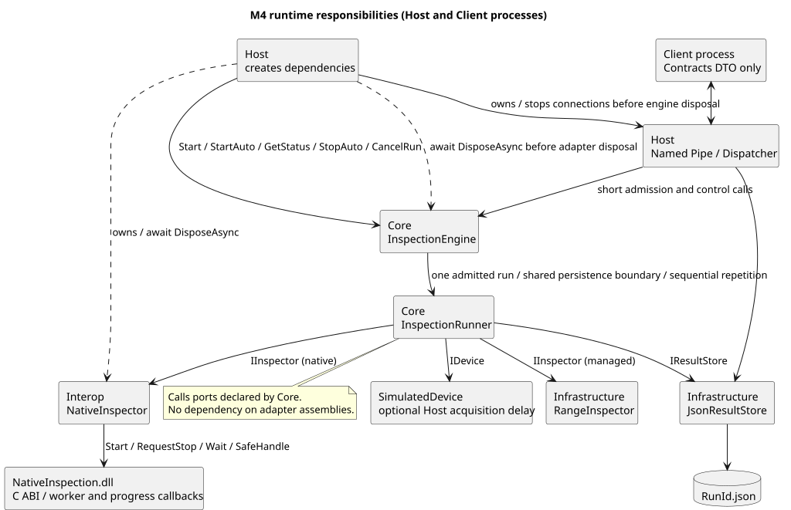
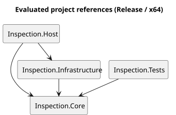
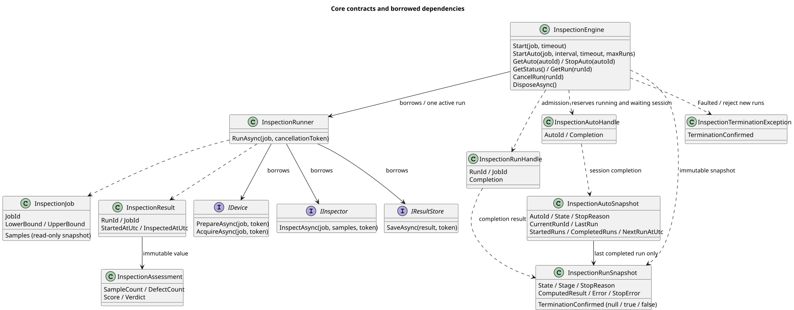
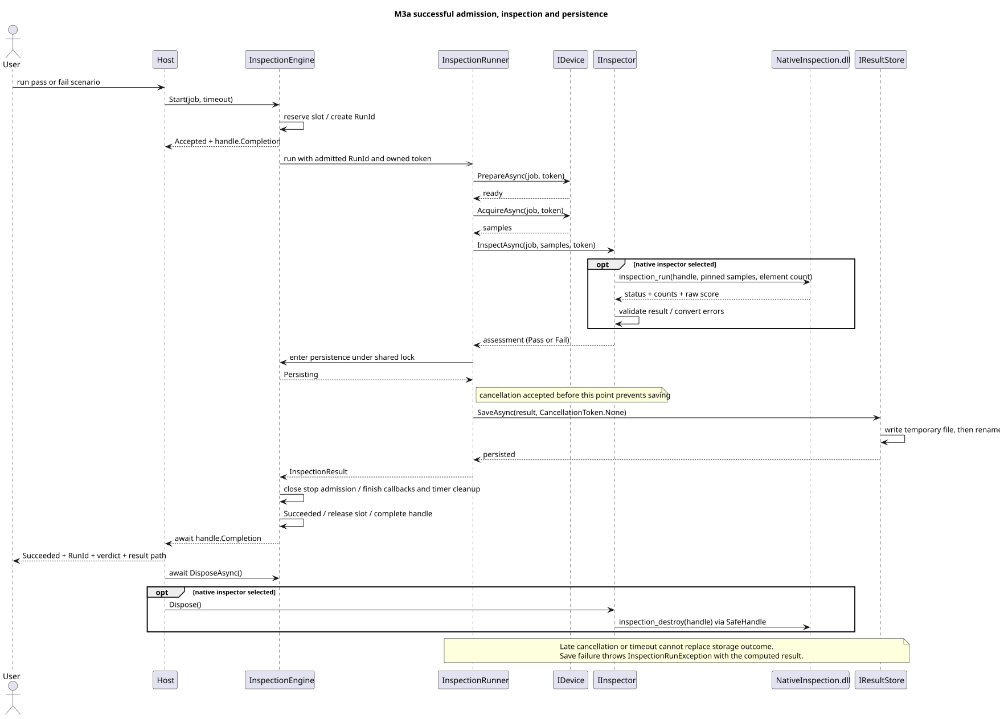
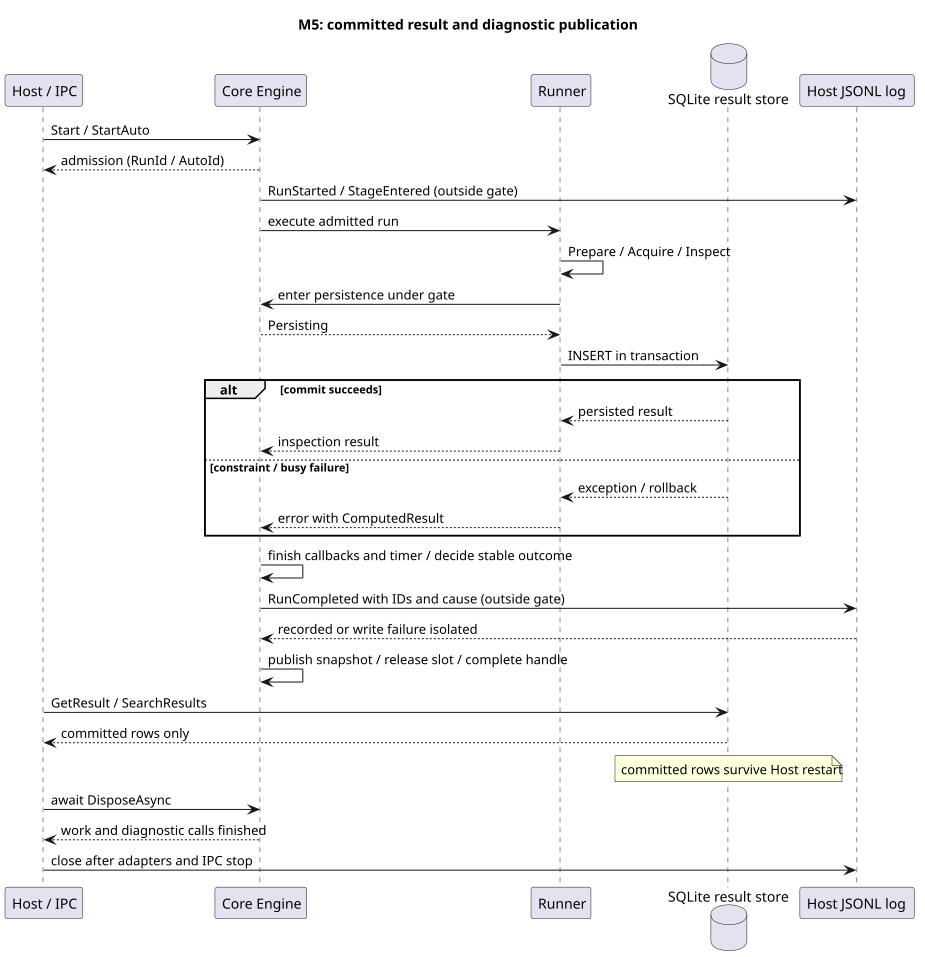

# M6 아키텍처

Host는 기존 한 건·자동 반복 CLI와 Named Pipe 서버 모드를 제공한다. 별도 Client는 Contracts DTO로 접수·조회·취소를 호출한다. C# RangeInspector, LibraryImport 기반 NativeInspector와 C++/CLI CliInspector를 선택하며 Core Engine의 접수·Busy·상태·취소·타임아웃·순차 자동 반복을 재사용한다. Native 협조적 정지·진행 콜백·실제 종료 후 해제 계약도 유지한다. JSON 또는 SQLite 저장을 선택하고 Host가 구조화 JSONL 진단을 기록한다. SQLite의 GetResult/SearchResults는 실행 접수와 독립된 조회 경로다.

책임 분리·도구 체계·완료 경계·JSON 저장·Native 연동을 선택한 이유는 [ADR 목록](adr/README.md)에 기록한다. 이 문서는 현재 계약을 설명하며 결정이 바뀌면 새 ADR과 함께 갱신한다.

## 프로젝트와 소유권

Host가 SimulatedDevice, 선택한 IInspector 구현, JSON/SQLite 저장소, JSONL 진단 sink, InspectionRunner, InspectionEngine을 생성한다. NativeInspector는 SafeHandle로 C++ 객체 하나를 소유하며 Host는 Engine의 DisposeAsync를 기다린 후 선택한 NativeInspector 또는 CliInspector를 해제한다. CliInspector는 NativeInspector의 수명 코드에 CliNativeApi를 주입해 소유한다. JsonResultStore는 각 저장의 FileStream을, SqliteResultStore는 각 호출의 연결·명령·트랜잭션을 메서드 안에서 해제한다. Host는 Engine과 어댑터가 종료된 뒤 로그를 닫는다. Engine은 실행별 토큰·타이머와 자동 세션의 예약 전용 토큰을 소유하고, Engine과 Runner 모두 주입받은 의존성은 해제하지 않는다.

실선은 평가된 ProjectReference와 명시된 혼합 DLL 파일 참조이며 점선은 Native DLL 호출이다. C# 프로젝트 8개·C++/CLI 1개·Native 1개를 사용한다. C++/CLI는 Core/Interop을 참조하며 Host/통합 테스트는 사전 빌드된 혼합 DLL만 파일 참조한다. 생산 프로젝트는 BCL과 허용된 프로젝트를 참조하며 Infrastructure에만 Microsoft.Data.Sqlite 9.0.20 직접 패키지 참조를 허용한다. 잠금 파일로 전이 의존성도 고정한다. Client는 Contracts만, Core와 Contracts는 다른 프로젝트를 참조하지 않는다. Tests는 Core만 참조한다. IntegrationTests는 실제 어댑터·DLL·파일·Host/Client 프로세스를 검사하며 Host 참조는 빌드 순서 전용이다. 프레이밍 소스는 Host/Client에 링크하고 Contracts에는 DTO·버전·오류 코드만 둔다. NativeInspection은 독립 C++ DLL이다.

Native와 C++/CLI는 Visual Studio MSBuild로 빌드하고 C# 프로젝트는 dotnet으로 빌드한다. build-cppcli.ps1과 Visual Studio 솔루션 모두 Native → Core/Interop → C++/CLI → Host/통합 테스트 순서를 유지한다. 혼합 DLL/ijwhost의 출력·publish 복사와 로드 실패는 [C++/CLI 비교](cpp-cli-comparison.md)를 따른다. [Native ABI와 수명 계약](native-interop.md)을 함께 읽는다.

B04의 [Windows CI](continuous-integration.md)는 같은 고정 환경과 verify.ps1을 새 checkout에서 실행하고 성공·실패 증거를 보관한다. 개발 검증 인프라이며 제품 프로젝트 참조나 런타임 소유권은 바꾸지 않는다. 실행·보관 결정은 [ADR-0017](adr/0017-windows-ci-and-verification-evidence.md), 실제 확인 상태는 [DEV03](../tasks/DEV03-windows-ci.md)을 따른다.

## 계약과 실행 순서

- `InspectionJob`은 JobId, 허용 범위, 가상 취득용 샘플을 생성 시 검증·복사한다. 배열 변경이 이미 만들어진 Job에 영향을 주지 않는다. 샘플은 가상 장비의 재현 가능한 입력이며 실제 장비 연동을 가정하지 않는다.
- `IDevice`는 준비·취득, `IInspector`는 측정값 판정, `IResultStore`는 저장을 담당한다. `IResultReader`는 RunId 조회, `IResultSearch`는 검증된 검색 조건을 받는다. `IInspectionDiagnostics`는 실행 시작·단계·최종 스냅샷을 관찰한다. Core에 SQL·파일 로그·IPC 타입은 없다.
- `InspectionEngine.Start`가 실행 자리를 확보하고 RunId를 발급한다. 내부 Runner 호출은 이 RunId를 그대로 사용한다. 기존 공개 Runner.RunAsync를 직접 호출하면 Runner가 새 RunId를 발급하며, 네 단계를 마쳐야 InspectionResult를 반환한다.
- `InspectionAssessment`는 샘플 수·불량 수·점수·제품 판정이다. `InspectionResult`에는 RunId, JobId, 시작 시각과 **검사 완료 시각**이 들어간다. InspectedAtUtc는 저장 완료 시각이 아니다.
- 단계 실패는 RunId·단계·원래 예외를 가진 InspectionRunException으로 전파한다. 저장 실패 시 ComputedResult도 보존한다. 외부 토큰 취소는 OperationCanceledException을 상속하는 InspectionCanceledException으로 전달한다.

취소 접수와 저장 진입은 Engine의 같은 잠금으로 결정한다. 취소가 먼저 접수되면 저장하지 않는다. 저장 진입 이후에는 호출자 취소 토큰을 저장소에 전달하지 않고 저장 결과를 기다린다. 저장 실패는 늦은 취소로 대체되지 않는다. Runner 직접 호출도 기존 원자적 경계를 유지한다. [Engine 상태·종료 계약](engine-contract.md)에 접수 결과, 최초 종료 원인, 실제 종료 대기와 조회 범위를 설명한다.

최종 진단은 Runner·취소 콜백·타이머 정리 후, 잠금 밖에서 기록한다. 기록 호출이 끝날 때까지 실행 자리를 유지하고 이후 완료를 게시한다. 진단 예외는 실행 결과를 바꾸지 않는다. sink는 자신의 실행 완료를 기다리면 안 된다.

## 결과 저장과 진단

저장소는 같은 폴더의 고유 `.tmp` 파일에 JSON을 기록하고 스트림을 닫은 뒤 `<RunId>.json`으로 이동한다. 기존 동일 RunId 파일을 덮어쓰지 않는다. 실패 시 임시 파일 정리를 시도하며 정리 실패가 원래 예외를 가리지 않게 한다. 비정상 프로세스 종료로 남은 `.tmp`는 완료 결과가 아니다. 전원 장애에 대한 디스크 영속성이나 재시작 후 실행 복구는 보장 범위가 아니다.

SQLite는 RunId 기본 키로 덮어쓰기를 막고 INSERT 트랜잭션의 commit 후 성공을 반환한다. WAL과 synchronous=FULL을 사용하되 저장 장치의 물리적 내구성을 보증하지 않는다. DB에는 저장 완료된 검사 결과만 남는다. 기간·판정·JobId와 커서로 검색하며 DB 재개방과 Engine/RequestId 재시작 복구는 별개다. 로그의 SessionId/RequestId/AutoId/RunId와 저장·Native 오류 코드는 [저장·진단 계약](storage-diagnostics.md)을 따른다.

## 검증 범위

Core MSTest 94개는 기존 실행·자동 계약과 조회 입력·진단 오류 격리·완료 게시 경계를 검증한다. 시간은 TimeProvider, 비동기 순서는 TaskCompletionSource로 제어한다. 통합 123개는 기존 87개와 C++/CLI 비교·수명·프로세스 34개, cli 저장 프로세스 2개다. 기존 Native 34·JSON 6·IPC 23·SQLite 11·저장 및 진단 13개를 유지한다. SQLite 트리거 롤백·잠금·미커밋 비가시성·재시작 조회와 저장/Native/IPC 장애를 실제로 재현한다. IPC 중 21개는 실제 Host 프로세스(4개는 별도 Client 실행 파일 포함), 2개는 실제 Pipe에서 잘못된 응답을 보내 Client 검증을 확인한다. 준비 출력·상태 응답을 관찰하고 프로세스 종료에 제한 시간을 둔다. 기존 두 검사기의 CLI·JSON·저장 오류·DLL 누락·즉시 타임아웃도 유지한다. [필수 사례 대응표](verification-map.md)로 누락·skip을 검사한다.

별도 프로세스도 [자동 실행 계약](auto-contract.md)의 AutoId/RunId 구분과 StopAuto/CancelRun 규칙을 따른다. [IPC 계약](ipc-contract.md)에 크기·버전·오류·재전송·조회 보존 범위를 명시한다. 연결 단절은 작업을 취소하지 않으며 새 연결에서 조회·취소한다. Host가 접수한 수동 실행·자동 세션 상태를 보존하고, 선택한 저장소의 IResultReader가 게시된 과거 결과를 읽는다. SQLite만 IResultSearch를 제공하며 조회는 Engine의 접수 잠금과 독립적이다. 저장 실패의 계산 결과는 상태 진단에만 노출한다. NativeInspector는 Start에서 입력을 복사하고 Wait에서 작업·콜백을 join한다. Wait 실패 시 자원을 보존하고 Engine을 Faulted로 고정한다. TerminationConfirmed=false를 실제 종료로 해석하지 않는다. [장애 대응](troubleshooting.md)을 따른다.
