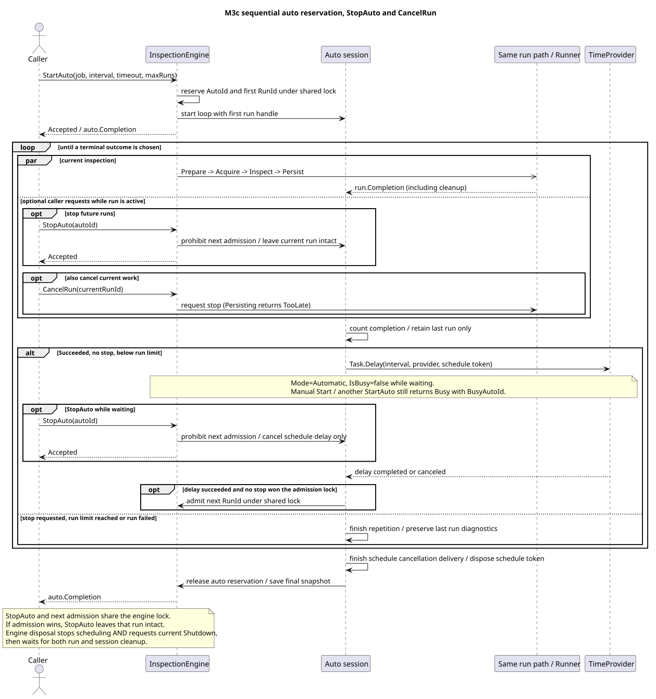

# M3c 자동 실행 계약

InspectionEngine이 동일한 Job을 순차 반복한다. [ADR-0010](adr/0010-sequential-auto-admission.md)에 결정과 대안을 기록한다. [한 건 실행·종료 계약](engine-contract.md)과 [Native 수명](native-interop.md)을 그대로 사용한다.

## 접수·예약·조회

`StartAuto(job, interval, timeout: null, maxRuns: null)`은 Accepted와 InspectionAutoHandle, 또는 Busy/Unavailable을 반환한다. interval은 0~4294967294ms, timeout은 기존 한 건 제한 시간 규칙, maxRuns는 양의 int 또는 null이다. null이면 중지까지 반복한다. Job은 기존 immutable 입력이며 자동 실행은 별도의 Job 생성기나 큐를 추가하지 않는다.

첫 실행은 즉시 접수한다. 각 실행에 새 RunId를 발급하며 JobId는 같다. 검사·저장·취소 콜백·정리가 끝난 후 interval을 기다린다. 실행 시간이 길어져도 밀린 실행을 적재하거나 동시에 시작하지 않는다. timeout은 매 실행 접수 때 새로 시작하며 반복 간격은 포함하지 않는다.

세션이 끝나기 전에는 수동 Start와 다른 StartAuto가 Busy다. Running뿐 아니라 Waiting·Stopping에도 예약을 유지한다. Engine의 IsBusy는 실제 실행 자리만 나타내므로 **Mode=Automatic, IsBusy=false**는 자동 대기 또는 완료 관찰 중일 수 있다. BusyAutoId가 예약한 세션을 나타내며 대기 중에는 BusyRunId가 null이다. 새 접수 가능 여부는 Start의 결과로 판단한다.

`GetAuto(autoId)`는 현재 세션과 직전 완료 세션을 조회한다. 더 오래된 결과는 접수 핸들의 Completion에만 남는다. Engine.GetStatus().Auto에는 현재 또는 마지막 세션이 있으며 현재 예약 여부는 Mode로 구분한다. AutoId는 세션, RunId는 각 검사, JobId는 입력 정의를 식별한다.

StartedRuns는 접수된 실행 수, CompletedRuns는 성공·실패·취소를 포함해 세션이 관찰한 완료 수다. CurrentRunId는 세션이 관찰 중인 실행, LastRun은 가장 최근에 관찰한 완료 스냅샷이다. 한 건 Completion과 자동 루프의 관찰 사이에는 짧은 차이가 있을 수 있다. NextRunAtUtc는 대기 중 예정 시각이며 정확한 시작 시각 보장은 아니다. 반환 스냅샷은 이후 변경되지 않고 전체 실행 이력을 메모리에 보관하지 않는다.

## 중지와 완료



| 상황 | 자동 세션 결과 |
| --- | --- |
| 검사·저장 성공, 제품 Pass 또는 Fail | 다음 간격 대기. maxRuns 도달 시 Completed/RunLimitReached |
| StopAuto가 실행 중 접수됨 | Stopping. 현재 작업을 취소하지 않고 완료 후 Stopped/Requested |
| StopAuto가 대기 중 접수됨 | 대기 취소·정리 후 Stopped/Requested. 새 실행 없음 |
| 현재 실행이 Canceled | Stopped/RunCanceled. LastRun.StopReason에 사용자 또는 Shutdown 원인 보존 |
| 현재 실행이 TimedOut | Stopped/RunTimedOut |
| 현재 실행이 Faulted | Faulted/RunFaulted. LastRun과 Error 보존 |
| 다음 대기 또는 실행 설정 실패 | Faulted/SchedulingFailed. 활성 작업 없는 일반 설정 실패는 새 명시적 접수 가능 |
| Native 종료·토큰 정리 실패 | 위 세션 실패와 함께 엔진 Faulted 유지, 신규 접수 거절 |

`StopAuto(autoId)`의 Accepted는 다음 접수 차단을 뜻하며 현재 실행 종료를 뜻하지 않는다. 같은 진행 중 요청은 AlreadyRequested, 완료 판정 이후는 TooLate, 조회 범위 밖 ID는 NotFound다. 실제 종료는 auto.Completion으로 기다린다.

최종 상태가 판정된 뒤에도 예약 취소 전달·토큰 정리가 남아 있을 수 있다. 예약 해제까지 기다릴 때는 상태 문자열만 확인하지 말고 Completion을 await한다. 정리가 끝나기 전에는 Mode=Automatic과 접수 차단을 유지한다.

다음 실행 접수와 StopAuto는 같은 잠금에서 결정한다. StopAuto가 먼저면 실행하지 않는다. 접수가 먼저면 해당 실행이 현재 실행이므로 끝날 때까지 기다린다. 현재 실행도 중단하려면 별도로 `CancelRun(CurrentRunId)`를 호출한다. StopAuto를 먼저 하면 두 호출 사이에 다음 실행이 접수되지 않는다.

CancelRun이 Persisting 이후 TooLate라면 결과가 바뀌지 않으며 반복도 그대로 계속된다. 이를 자동 중지 명령으로 사용하지 않는다. 실행 실패와 StopAuto가 겹치면 실패 결과가 우선하며, 성공한 실행에서는 예약 중지 요청이 횟수 완료보다 우선한다.

Engine.DisposeAsync는 접수를 닫고 자동 예약 중지, 현재 실행 Shutdown을 요청한 뒤 실행과 세션 정리를 기다린다. 저장 중이면 저장을 마친다. 대기 중 종료는 Stopped/Shutdown, 실행 중 취소 완료는 Stopped/RunCanceled와 LastRun.StopReason=Shutdown으로 나타난다. 정지 요청 전에 이미 종료 원인이 있었다면 기존 원인을 유지한다. Native 종료 미확인 상태는 TerminationConfirmed=false와 Faulted이며 자원을 보존한다.

## 사용 예

```csharp
InspectionAutoHandle auto = engine.StartAuto(job, TimeSpan.FromSeconds(1),
    timeout: TimeSpan.FromSeconds(10), maxRuns: 3).Auto!;
// Another caller can call engine.StopAuto(auto.AutoId).
InspectionAutoSnapshot completed = await auto.Completion;
Console.WriteLine($"{completed.AutoId}: {completed.State}, {completed.CompletedRuns}");
```

Host는 `--repeat 3 --interval-ms 1000`으로 유한 반복을 실행한다. --repeat을 생략하면 기존 한 건 실행, 반복 간격 기본값은 1000ms다. --interval-ms는 --repeat과 함께 사용한다. `--timeout-ms`는 매 실행에 적용한다. Ctrl+C는 예약 중지 후 현재 RunId에 취소를 요청한다. 한 건 CLI에는 별도의 StopAuto 대화형 명령이 없다. M4 서버 모드는 [IPC 계약](ipc-contract.md)의 StartAuto/StopAuto/CancelRun을 제공한다.

콘솔에는 세션 요약과 마지막 실행의 RunId·결과를 출력하고, 모든 성공 실행은 고유 RunId.json 파일로 남긴다. 자동 성공은 0, 실행·예약 오류는 1, 인수 오류는 2, 시간 초과는 124, 중지는 130이다. 마지막 실행이 Succeeded여도 자동 세션의 중지·오류 종료 코드는 유지한다.

Core 31개 새 사례는 수동 시간과 명시적 신호로 순서를 검증한다. 실제 DLL 2개 사례와 Host의 반복 Pass/Fail·저장 오류·시간 초과 검증을 추가한다. [검증 대응표](verification-map.md)와 [M3c 작업](../tasks/M03c-auto-sequence.md)에 실제 증거를 연결한다.
