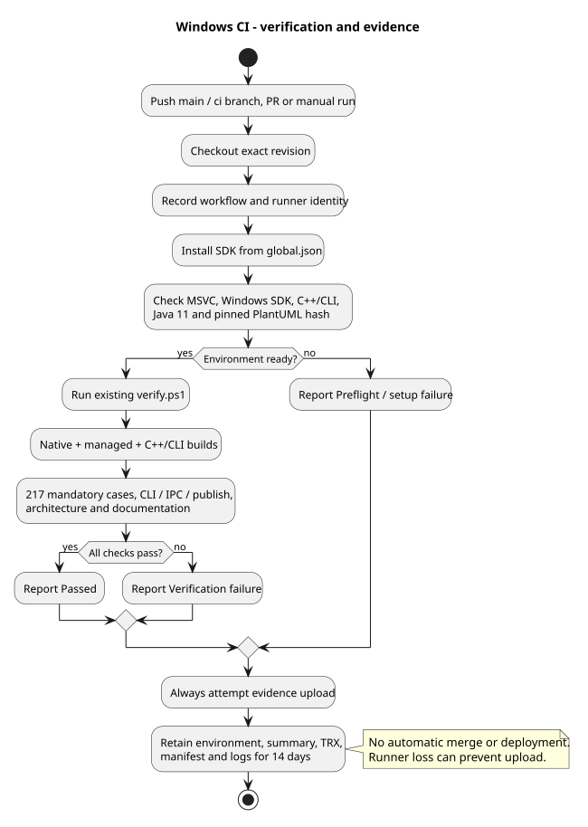

# Windows CI와 검증 증거

[ADR-0017](adr/0017-windows-ci-and-verification-evidence.md)에 실행 환경과 보관 정책을 기록한다. 구현과 실제 원격 확인 상태는 [DEV03 작업](../tasks/DEV03-windows-ci.md)에서 구분한다.

## 실행 경로

[workflow](../.github/workflows/verify.yml)는 main push, main 대상 PR, 수동 실행과 ci/** branch push에서 Windows x64 job을 시작한다. 다른 기능 브랜치는 PR을 통해 검사한다. 같은 branch/PR의 이전 실행을 취소한다. 자동 수정·병합·배포는 없다.



setup-dotnet은 global.json의 SDK 9.0.305를 준비한다. prepare-ci.ps1은 기존 Native/C++/CLI 도구와 Java 11을 검사하고 기존 PlantUML 해시와 일치하는 Maven Central JAR를 준비한다. GitHub 배포 JAR와 Maven JAR는 같은 버전이어도 바이트가 다르므로 버전명만 비교하지 않는다. Java는 runner의 JAVA_HOME_11_X64를 우선 사용하고 로컬에서는 PATH의 Java 11도 허용한다.

MSVC는 toolset 폴더 14.44.35207을 고정하고 실제 compiler 파일 버전도 증거에 남긴다. 같은 폴더의 servicing 버전과 Java 11의 patch 버전까지 동일하게 고정한 것은 아니다. 실제 원격 도구 버전과 이미지 버전은 DEV03의 성공 실행 기록을 참고한다.

로컬에서 동일 진입점을 확인할 수 있다. 기존 설치를 업그레이드하지 않으며 사전 검사에 필요한 JAR만 artifacts/ci-tools에 다운로드한다.

```powershell
powershell -NoProfile -ExecutionPolicy Bypass -File scripts/ci.ps1
```

ci.ps1은 환경 검사 후 기존 `scripts/verify.ps1`을 실행한다. Native→Core/Interop→C++/CLI→Host/테스트 순서, 217개 필수 사례, Native/IPC/publish, 참조·문서 검증은 동일하다. CI 전체 30분, 사전 검사 120초, 전체 verify 호출 20분이며 기존 검증 단계별 제한은 변경하지 않는다. 느린 새 checkout의 실패가 실제 확인되면 작업 기록과 함께 제한 시간을 검토한다.

## 결과 읽기

GitHub Actions의 Windows verification 실행에서 `verification-<run-id>-<attempt>` artifact를 확인한다. 보관 기간은 14일이며 원격 정책의 상한을 따른다. `if: always()`로 정상·실패 양쪽에서 업로드를 시도하고, 파일이 하나도 없으면 업로드 단계도 실패한다.

| 증거 | 확인할 내용 |
| --- | --- |
| artifacts/ci/workflow.json | checkout commit, 실행 ID/attempt, event, runner 이미지 버전; SDK 설치 전 생성 |
| artifacts/ci/environment.json | 고정 SDK·컴파일러·Java·PlantUML 확인과 환경 실패 원인 |
| artifacts/ci/result.json | Preflight/Verification 중 어느 단계에서 실패했는지, 종료 코드 |
| artifacts/ci/*.log | 사전 검사와 verify 호출의 stdout/stderr |
| artifacts/verification/<id>/summary.json·source-manifest.json | 실제 검증 상태, 기준 commit·소스/DLL 해시 |
| TRX·검증/IPC *.log | 정확한 필수 테스트 사례, Native/Host/Client 프로세스 실패 원인 |

DLL·DB·runtime 결과 파일·전체 환경 변수·인증 파일은 업로드 대상에 넣지 않는다. 생성된 SVG는 저장소에 커밋하고 CI에서는 새로 렌더링해 일치 여부를 검사한다. runner 손실이나 checkout 실패처럼 파일을 생성·업로드할 수 없는 경우는 GitHub의 job 로그로 확인한다.

## 실패 구분과 적용 범위

환경 실패는 정확한 SDK/MSVC/SDK/Java/JAR를 준비한 뒤 다시 실행한다. 필수 Native/C++/CLI 사례를 skip하거나 도구 pin을 자동 변경하지 않는다. 검증 실패는 해당 summary·TRX·stderr와 commit을 대조한다. 의도한 실패 확인은 별도 ci/** 후보 브랜치에서 문서 링크 오류 등을 만들고, 실패한 job에서도 증거가 보관되는지 확인한 후 그 변경을 정상 브랜치에 포함하지 않는다.

CI 코드의 로컬 통과와 실제 GitHub 실행 통과는 별개다. 필수 상태 검사나 보호 규칙은 원격 검증 확인 후 저장소 운영 설정으로 적용한다. 이 CI는 B03의 보호된 반복 제어기를 구현하지 않으며 장기 운영 DB/로그의 백업 체계도 아니다.
