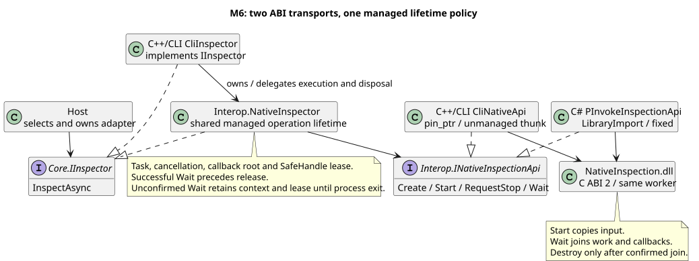

# M6 C++/CLI 어댑터 비교

[ADR-0015](adr/0015-cpp-cli-transport-and-shared-lifetime.md)는 호출 방식과 공유 수명, [ADR-0016](adr/0016-cpp-cli-build-and-deployment.md)은 빌드·배포를 설명한다.

## 실행

Visual Studio 2022의 v143 C++/CLI 지원 구성 요소가 필요하다. SDK/컴파일러/플랫폼은 기존 고정값을 사용한다.

```powershell
powershell -NoProfile -ExecutionPolicy Bypass -File scripts/build-cppcli.ps1
dotnet run --project src/Inspection.Host -c Release -- --inspector cli --scenario fail --store sqlite --output artifacts/cli-demo
dotnet run --project src/Inspection.Host -c Release -- --inspector cli --repeat 3 --interval-ms 0
dotnet run --project src/Inspection.Host -c Release -- --serve --inspector cli --pipe InspectionLab --store sqlite --output artifacts/cli-demo
```

기본 검사기는 managed다. native는 LibraryImport, cli는 C++/CLI에서 같은 Native DLL을 호출한다. 자동 실행·취소·타임아웃·JSON/SQLite·IPC 요청 형식은 동일하다. 제품 Fail도 저장에 성공하면 Succeeded다. [IPC 계약](ipc-contract.md)과 [저장·진단](storage-diagnostics.md)의 요청·검색·장애 옵션을 그대로 사용한다. native-inspect/native-wait 장애 모드는 native와 cli에 적용한다.

Debug는 `build-cppcli.ps1 -Configuration Debug`를 먼저 실행하고 `dotnet run -c Debug`를 사용한다. Visual Studio에서는 InspectionLab.sln의 x64 구성을 빌드한다. dotnet으로 혼합 솔루션을 빌드하지 않는다. 전체 검증은 `scripts/verify.ps1`이다.

## 비교 범위

| 항목 | native | cli |
| --- | --- | --- |
| 제품 계약 | Core.IInspector | Core.IInspector |
| 호출 구현 | C# LibraryImport | C++/CLI와 C++ import library |
| 입력 고정 | fixed | pin_ptr |
| Native 구현 | 동일 NativeInspection.dll ABI 2 | 동일 NativeInspection.dll ABI 2 |
| 실행/취소/콜백 수명 | NativeInspector의 관리 수명 코드 | 같은 코드에 CliNativeApi 주입 |
| 해제 | SafeHandle → LibraryImport Destroy | SafeHandle → C++/CLI release delegate → Destroy |
| 추가 배포 | NativeInspection.dll | Inspection.CppCli.dll, ijwhost.dll, NativeInspection.dll |

CliInspector가 IInspector를 구현하면서 관리 수명 객체를 소유한다. INativeInspectionApi는 Interop 안의 어댑터 간 계약이며 Core는 이를 모른다. 진행 콜백은 기존 관리 trampoline과 GCHandle을 공유한다. C++/CLI 자체의 gcroot 콜백 예제를 추가한 것은 아니다. 성능 측정이나 C++ 전용 SDK 래핑도 이번 비교에 포함되지 않는다.



## 종료와 오류

Start는 입력을 복사한다. 배열 pin은 Start 반환 시 끝나지만 SafeHandle 추가 참조·콜백 문맥은 성공한 Wait까지 유지한다. 취소는 정지 요청이며 완료가 아니다. 콜백이 반환해야 Wait가 join하고 Task가 끝난다. DisposeAsync도 진행 중인 작업을 기다린다. Wait 실패로 종료를 확인하지 못하면 참조와 문맥을 프로세스 수명 동안 보존하고 엔진 재접수를 거절한다.

Native 오류 이름·숫자와 Operation, TerminationConfirmed는 기존 JSONL 형식을 사용한다. `--inspector cli --fault native-wait`로 같은 미확인 종료를 재현할 수 있다. 복구는 Host 재시작이다. 자신을 호출한 진행 콜백 안에서 자신의 Dispose/Completion을 기다리면 안 된다.

## 빌드·배포 확인

build-cppcli.ps1은 Native DLL, 관리 Core/Interop, 혼합 DLL 순서로 빌드한다. Host/통합 테스트는 사전 빌드된 혼합 어셈블리를 파일 참조하므로 초기 실행 전에 스크립트가 필요하다. 참조 검사에서 파일 경로·복사 설정까지 확인한다. 검증은 실행 출력과 publish 출력의 세 DLL 해시 및 각각의 누락 오류를 확인한다. cli 선택 시 의존 DLL이 없으면 Setup 실패이며 자동 대체하지 않는다.

C++/CLI에는 MSVC 동적 런타임과 .NET x64 런타임이 필요하다. 현재 컴퓨터의 Release/Debug 빌드·실행과 publish를 검증하며 새 컴퓨터 설치나 자체 포함 배포까지 완료한 것은 아니다. C4679 제외는 고정 컴파일러의 숫자 타입 메타데이터 경고에 한정하며 도구 이전 시 재검토한다.
