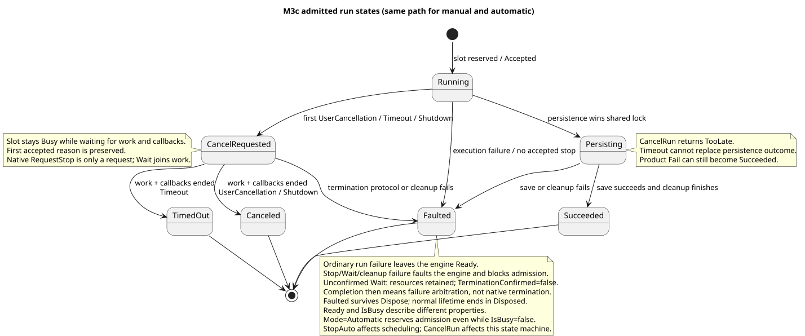
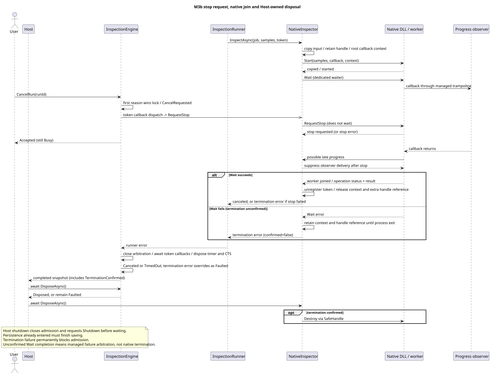

# M3b Engine 계약

InspectionEngine은 단일 실행 접수·상태·취소·시간 제한을 관리한다. Inspector와 장비는 Core 포트로 빌려 쓰며 Host가 소유한다. 결정의 배경은 [ADR-0006](adr/0006-single-run-engine.md)과 [ADR-0009](adr/0009-termination-failure-quarantine.md)에 있다. 0009는 M3a의 0007을 확장·대체한다.

## 접수와 조회

`Start(job, timeout)`은 Accepted, Busy, Unavailable 중 하나를 반환한다. Accepted만 새 RunId와 `InspectionRunHandle.Completion`을 가진다. Busy는 이미 실행 자리가 사용 중인 경우이며 해당 BusyRunId를 반환한다. 종료 중·해제 후·엔진 장애는 Unavailable이다. 잘못된 Job·시간 제한은 접수 전에 예외로 거절한다. 실행 큐는 없다.

`GetStatus()`는 엔진 수명 상태와 IsBusy, 현재 또는 마지막 실행을 반환한다. Ready는 접수 기능이 열려 있다는 뜻이며 실행 중에도 Ready/IsBusy=true일 수 있다. `GetRun(runId)`는 현재 실행과 직전 완료 실행만 조회한다. 그보다 오래된 결과는 접수 때 받은 Completion에 남으며 전체 이력 검색은 제공하지 않는다.

스냅샷은 이후 상태 갱신의 영향을 받지 않는다. State와 Stage는 구분한다. State는 실행 상태, Stage는 Runner가 진입을 시도하는 Prepare/Acquire/Inspect/Persist 단계다. 최초 접수 직후 아직 Runner가 시작되지 않았다면 Stage는 null이다. AcceptedAtUtc, 실제 Runner 시작·검사 완료 시각, CompletedAtUtc도 서로 다른 시점이다.

## 취소·시간 제한·완료



| 상황 | 처리 |
| --- | --- |
| 저장 전 처음 취소·시간 초과·종료 요청 | 원인 기록, CancelRequested, 토큰 취소 전달 |
| 다른 종료 원인이 이미 접수됨 | AlreadyRequested, 처음 원인 유지 |
| Persisting 또는 완료 판정이 닫힌 뒤 요청 | TooLate, 저장·실행 결과 유지 |
| 알 수 없는 RunId에 취소 요청 | NotFound |
| 실제 Runner·토큰 콜백 종료, 사용자 취소 또는 Shutdown | Canceled |
| 실제 Runner·토큰 콜백 종료, Timeout | TimedOut |
| 저장 성공, 종료 처리 성공 | Succeeded, 제품 Fail도 포함 |
| 먼저 접수된 종료 원인 없이 실행·저장 실패 | 실행 Faulted, 엔진은 다시 접수 가능 |
| 취소 콜백·타이머 정리 실패 | 실행 및 엔진 Faulted, 새 접수 거절 |
| 의존성 종료 프로토콜 실패 | 접수된 종료 원인보다 우선해 실행·엔진 Faulted. 원인은 보존하고 새 접수 거절 |

원인 접수와 저장 진입은 같은 잠금에서 판단한다. 먼저 접수된 원인이 있으면 저장 진입을 막는다. 원인이 없는 실행이 Persisting에 먼저 들어가면 이후 취소나 시간 초과가 저장 결과를 변경하지 않는다. 저장소에는 취소되지 않는 토큰을 전달한다.

Runner가 실제로 반환하면 완료 판정 구간을 닫는다. 그 전에 접수된 원인이 있으면 해당 종료 상태를 유지하고, 동시에 발생한 일반 실행 오류도 Error에 남긴다. 단, InspectionTerminationException은 종료 원인보다 우선하여 Faulted로 판정하고 Engine.Error에도 남긴다. ComputedResult는 저장 성공을 뜻하지 않으며 계산이 끝났다면 진단용으로 보존한다. 성공 여부는 반드시 State로 판단한다. StopError는 취소 콜백·타이머 정리 실패다.

시간 제한은 접수 시 시작한다. null 또는 InfiniteTimeSpan은 무제한, 0은 장비 호출 전 즉시 Timeout 요청이다. 유한 범위는 0~4294967294ms이며 Host는 정수 ms를 받는다. 일회성 TimeProvider 타이머를 사용하고 테스트에서는 실제 시간을 기다리지 않고 시간을 전진시킨다. 이전 타이머 콜백은 실행 객체를 확인하므로 새 실행을 취소하지 못한다.

## 수명과 실제 종료



Engine은 내부 CancellationTokenSource와 타이머를 소유한다. CancelAsync는 토큰을 즉시 취소 상태로 만들고 콜백을 비동기로 전달한다. Engine은 Runner 반환과 콜백 종료·타이머 정리를 모두 마친 뒤 완료 Task를 확정하고 실행 자리를 비운다. 단순 대기 취소로 실행 자리를 반환하지 않는다.

장비·검사기 포트의 Task 완료는 해당 작업이 실제로 끝났다는 뜻이어야 한다. 어댑터가 사용 중인 버퍼나 백그라운드 작업을 남긴 채 Task를 먼저 완료하면 Engine은 실제 종료를 판단할 수 없다. Native 어댑터도 정상 경로에서는 Wait로 작업·콜백 종료를 확인한다. 예외는 Wait 자체의 실패다. 이때 TerminationConfirmed=false와 Faulted를 반환하며 Native 자원을 프로세스 종료까지 보존한다. Completion/CompletedAtUtc는 관리 측 장애 판정 완료이고 실제 Native 종료는 미확인이다. IsBusy=false여도 Faulted 엔진은 영구적으로 접수를 거절한다. 진행 중 TerminationConfirmed는 null, 종료 확인 후에는 true다.

DisposeAsync는 신규 접수를 차단하고 현재 실행에 Shutdown을 요청한 뒤 완료를 기다린다. 이미 Persisting이면 저장 결과를 기다린다. 반복 Dispose는 같은 종료를 관찰하며 주입된 Runner·장비·검사기·저장소를 해제하지 않는다. Host는 Engine 종료를 기다린 후 자신이 만든 NativeInspector를 해제한다.

NativeInspector는 Start/RequestStop/Wait를 사용한다. 취소된 토큰은 협조적 정지만 요청하고 실제 종료·콜백 반환은 Wait가 확인한다. 정지 실패 후에도 Wait를 기다리고 종료 확인 후 Faulted를 반환한다. Wait가 반환하지 않으면 Busy와 Dispose 대기가 유지된다. Wait 오류가 반환되면 위의 자원 보존 경로를 적용한다. 종료 실패 엔진은 Dispose 후에도 Faulted를 유지한다. Native 진행 관찰자는 자기 작업의 완료를 동기로 기다리면 안 된다.

## 호출 예

```csharp
await using var engine = new InspectionEngine(runner);
InspectionStartResult start = engine.Start(job, TimeSpan.FromSeconds(10));
if (start.Run is { } run)
{
    InspectionEngineSnapshot status = engine.GetStatus();
    // Another caller can request engine.CancelRun(run.RunId).
    InspectionRunSnapshot completed = await run.Completion;
    Console.WriteLine($"{completed.RunId}: {completed.State}");
}
```

Completion은 실행의 실패·취소도 스냅샷으로 반환한다. 기존 Runner.RunAsync 직접 호출은 예외 기반 계약을 유지한다. Host는 CLI 한 건 실행이며 다른 프로세스의 상태 조회·취소 명령은 M4에서 연결한다.
