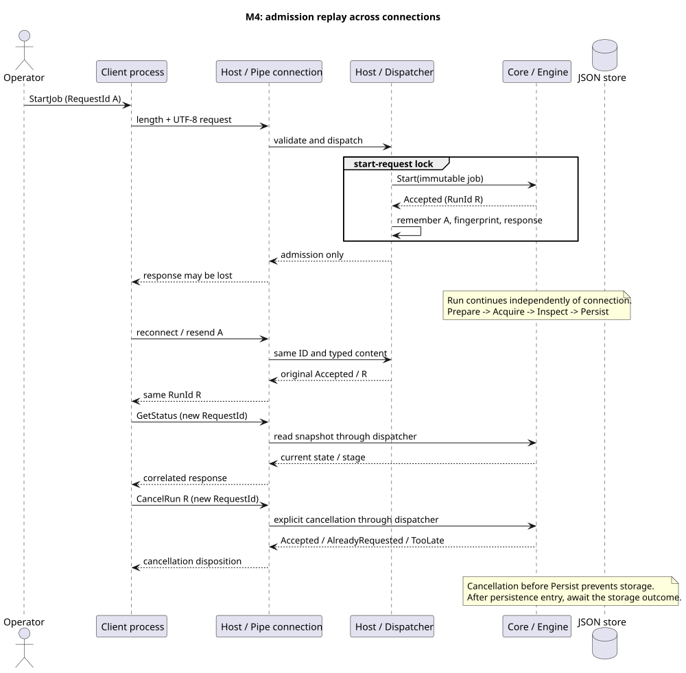

# M5 IPC 계약

Host와 Client는 서로 다른 프로세스다. Core에는 IPC 의존성이 없다. [ADR-0011](adr/0011-named-pipe-protocol.md)은 전송 경계, [ADR-0013](adr/0013-sqlite-results-and-query.md)은 기존 재전송·연결 수명을 유지하면서 저장소 선택과 검색을 확장한다. M4의 결정은 [ADR-0012](adr/0012-start-request-replay.md)에 보존한다.



## 실행

먼저 README의 Native 빌드와 관리 프로젝트 restore를 수행한다. 터미널 하나에서 서버를 실행한다.

```powershell
dotnet run --project src/Inspection.Host -c Release -- --serve --pipe InspectionLab --inspector native
```

다른 터미널에서 요청 파일을 만든 뒤 별도 Client로 보낸다. 아래 ID는 **한 논리적 시작 요청의 ID**다. 같은 파일 재전송은 처음의 접수 응답을 돌려준다. 새 실행에는 새 GUID를 넣는다.

```powershell
$request = @{
    ProtocolVersion = 1
    RequestId = [Guid]::NewGuid().ToString()
    MessageType = 'StartJob'
    Payload = @{ Job = @{ JobId = 'sample-01'; Samples = @(10,20,140); LowerBound = 0; UpperBound = 100 } }
}
New-Item -ItemType Directory -Path artifacts -Force | Out-Null
[IO.File]::WriteAllText((Join-Path $PWD 'artifacts/start.json'), ($request | ConvertTo-Json -Depth 8), [Text.UTF8Encoding]::new($false))
dotnet run --project src/Inspection.Client -c Release -- --pipe InspectionLab --request artifacts/start.json
```

파일은 UTF-8 JSON(프로그램 예시는 BOM 없음)이다. Client는 접속부터 응답까지 10초 이내 한 요청을 보내고 JSON 응답을 출력한다. 종료 코드 0은 프로토콜 요청 성공이며 **검사 완료를 뜻하지 않는다**. 프로토콜 오류는 3, 파일/전송 오류는 1, CLI 인수 형식 오류는 2다. 접수 payload의 Disposition이 Busy/Unavailable인 경우도 성공적으로 받은 접수 판단이므로 0이다.

GetStatus용 파일은 MessageType을 GetStatus, Payload를 `{}` 또는 `{"RunId":"응답 RunId"}`로 바꾸고 새 RequestId를 사용한다. GetResult/CancelRun은 `{"RunId":"..."}`, StopAuto는 `{"AutoId":"..."}`를 사용한다. Client 연결 API는 한 연결에서 여러 요청을 지원하고 실패한 교환 후에는 다시 ConnectAsync해야 한다. 자동 재시도는 하지 않는다.

Host는 `exit` 입력 또는 Ctrl+C로 새 연결/요청을 닫고 Engine을 종료한 뒤 Native 어댑터를 해제한다. `--device-delay-ms 60000`은 가상 취득 대기를 설정하는 실습 옵션이며 취소 관찰에 사용할 수 있다. 기본값은 0이고 최대 60초다. `--output`으로 서버의 결과 폴더를 지정한다.

## 프레임과 필드

4바이트 little-endian 양의 길이 뒤에 UTF-8 JSON 본문이 온다. 본문 한계는 65,536바이트, JSON 깊이는 16, JobId는 128 UTF-16 코드 단위, 샘플은 최대 4,096개다. JobId는 공백만일 수 없고 샘플은 비어 있지 않은 유한 수, 범위는 유한 수이며 하한 ≤ 상한이다. 샘플 수 이내라도 바이트 크기 한계를 넘으면 거절한다.

요청의 ProtocolVersion, RequestId, MessageType, Payload는 필수다. RequestId는 Empty가 아닌 GUID다. 속성 이름과 명령명은 대소문자를 구분한다. 알 수 없는 속성, 중복 속성, 필수 누락과 null을 거절한다. 선택 필드는 아래의 기본값을 사용한다. 응답은 ProtocolVersion, RequestId, ErrorCode, ErrorMessage, Payload를 가진다. 성공이면 오류 필드는 null, 오류이면 Payload는 null이다.

| 명령 | Payload | 성공 응답 |
| --- | --- | --- |
| StartJob | Job, 선택 TimeoutMilliseconds(null: 무제한) | Disposition, RunId, AutoId=null, BusyRunId, BusyAutoId |
| StartAuto | Job, IntervalMilliseconds, 선택 TimeoutMilliseconds, MaxRuns(null: 무제한) | Disposition, AutoId, RunId=null, BusyRunId, BusyAutoId |
| GetStatus | 선택 RunId 또는 AutoId; 둘 다 생략하면 현재 상태 | State, Mode, IsBusy, Run, Auto |
| CancelRun | RunId | Disposition: Accepted/AlreadyRequested/TooLate/NotFound |
| StopAuto | AutoId | 같은 네 가지 Disposition |
| GetResult | RunId | RunId, JobId, StartedAtUtc, InspectedAtUtc, Verdict, Score, SampleCount, DefectCount |
| SearchResults | 선택 FromUtc, ToUtc, Verdict, JobId, Limit(기본 25), Cursor | Items, NextCursor; SQLite만 지원 |

SearchResults는 검사 완료 시각의 시작 포함·끝 제외 범위, 정확한 JobId와 Pass/Fail, 최대 25개 페이지를 사용한다. 정렬·커서·요청 예시는 [저장·진단 사용법](storage-diagnostics.md)에 있다. 버전 1의 추가 명령이며 M4 서버에 보내면 InvalidRequest다. 기존 명령/필드는 유지한다.

Job의 필드는 JobId, Samples, LowerBound, UpperBound다. 시간 값은 정수 0~4,294,967,294ms, MaxRuns는 양의 int다. timeout 0도 접수되고 실행 결과는 TimedOut이다. StartAuto 간격은 저장·정리가 끝난 뒤의 대기 시간이다. 제품 Fail은 실행 Succeeded이며 자동 반복이 계속된다.

Run에는 실행 상태·단계·종료 원인·시각·TerminationConfirmed·ComputedResult·ErrorCode가 들어간다. 오류 메시지나 Exception 자체는 보내지 않는다. 상태 값은 [Engine 계약](engine-contract.md)과 [자동 계약](auto-contract.md)의 이름을 사용한다. IsBusy는 현재 한 건의 활성 여부이며 자동 대기 중에는 false일 수 있다. Mode=Automatic과 Auto의 상태를 함께 확인한다. 이때도 수동 시작은 Busy다.

## 재전송·조회 범위

StartJob/StartAuto의 검증된 접수 응답은 Host 프로세스에서 최대 4,096개 보존한다. 같은 RequestId/명령/typed payload이면 첫 응답을 반환하며 배열 순서와 문자열 내용은 의미에 포함된다. JSON 속성 순서·공백·숫자의 동등한 DTO 표현과 선택 필드 기본값 차이는 정규화한다. ID에 다른 내용을 보내면 RequestIdConflict다. Busy를 재전송해도 Busy이므로 새 시도는 새 ID를 사용한다. 용량이 차면 새 시작만 거절하고 기존 재전송·조회·취소·예약 중지는 계속 가능하다.

GetStatus/GetResult/SearchResults/CancelRun/StopAuto 응답은 캐시하지 않는다. 조회는 최신 상태, 제어는 현재 판단을 반환한다. 새 명령에는 새 ID를 사용한다. 시작에 사용한 ID를 다른 명령으로 재사용하면 충돌이다. 재시작 후 같은 시작 요청을 재전송하면 **새 실행이 생길 수 있다**. 영속 중복 방지는 없다.

연결 단절·Client 시간 초과는 실행을 취소하지 않는다. 다시 접속해 원래 시작 요청을 재전송하여 ID를 얻거나 이미 받은 RunId/AutoId로 조회한다. 접수한 수동 실행과 자동 세션의 완료 상태는 Host 수명 동안 보관한다. 과거 자동 개별 실행 상태는 Core의 현재/마지막 범위까지만 제공한다. 성공한 과거 결과는 선택한 JSON/SQLite 저장소에 있으면 GetResult로 읽을 수 있으며, Core의 현재 실행과 무관하다. 결과가 없으면 ResultNotFound이며 그것만으로 실행 실패/진행 여부를 판단하지 않는다.

## 오류와 격리

| 코드 | 의미 |
| --- | --- |
| InvalidRequest | envelope/명령/필드/값 오류 |
| UnsupportedVersion | 버전 1 외 요청 |
| RequestIdConflict | 기존 시작 ID와 다른 내용 또는 명령 |
| ReplayCapacityExceeded | 새로운 시작 ID를 보존할 공간 없음 |
| RunNotFound / AutoNotFound | 보존 범위에 없는 상태 |
| ResultNotFound | 선택한 저장소에 게시 결과 없음 |
| StoreReadFailed | 저장소 읽기·파싱·식별 검증 실패 |
| SearchNotSupported | JSON 저장 모드에서 검색 요청 |
| ExecutionFailed / StopFailed | Run.ErrorCode의 실행·종료 진단 |

잘못된 프레임 길이, 잘린 본문, 10초 프레임 기한 초과는 해당 연결을 닫는다. 파싱 불가능한 JSON envelope는 신뢰할 RequestId가 없으므로 응답 없이 닫는다. 유효한 envelope의 잘못된 명령은 원래 RequestId의 오류로 응답하고 연결을 유지한다. 한 연결의 오류가 다른 연결이나 Engine을 취소하지 않는다.

최대 16개 연결과 동일 사용자 접근을 지원한다. 같은 권한 수준으로 두 콘솔을 실행한다. 이 설계는 원격 통신·다중 사용자 권한·서비스 계정 인증을 제공하지 않는다. 한 연결은 응답 쓰기가 직렬이며 대량 요청을 보낼 때 Client도 응답을 읽어 흐름을 진행시켜야 한다.
