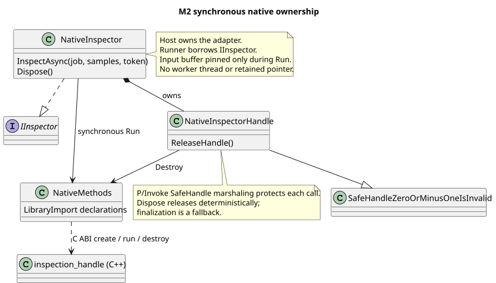

# M2 Native ABI와 소유권

M2는 동기식 숫자 배열 검사를 C ABI로 호출한다. 가상 검사 규칙은 C# RangeInspector와 같다. Core 인터페이스는 바꾸지 않았으며 P/Invoke 선언과 Native 오류·수명 관리는 Inspection.Interop에 둔다.

선택한 이유와 대안은 [ADR-0005](adr/0005-native-c-abi-adapter.md)에 기록한다. 비동기 Native 수명으로 변경할 때는 새 ADR과 이 계약 문서를 함께 갱신한다.

## ABI v1

- Windows x64, C++17, C ABI export, Cdecl 선언을 사용한다. C++ class, bool, size_t, STL 객체를 경계에 노출하지 않는다.
- `inspection_create(mode, out handle)`는 객체 하나를 만들고 `inspection_destroy(handle)`가 해제한다. 실패 시 출력 핸들은 null이다. 호출자는 살아 있는 핸들만 전달하며 한 번만 해제한다.
- `inspection_run(handle, samples, count, lower, upper, result)`의 count는 double **원소 수**다. Native는 동기 호출 동안만 버퍼를 읽고 포인터를 보관하지 않는다. 관리 배열의 slice도 해당 위치와 길이만 고정해서 전달한다.
- 결과는 `int32 sampleCount`, `int32 defectCount`, `double score` 순서이며 크기 16바이트, score 오프셋은 8이다. 양쪽 기본 정렬을 사용하며 Pack=1을 지정하지 않는다. Native static_assert와 실제 DLL 통합 테스트로 확인한다.
- Native score는 반올림 전 정상 비율이다. 어댑터는 Native 점수와 count의 일관성을 확인하고 기존 InspectionAssessment를 만든다. 외부 출력은 기존 규칙대로 소수 둘째 자리까지 반올림한다.
- ABI 버전과 결과 크기는 객체 생성 전에 검사한다. DLL은 Interop 어셈블리 디렉터리에서 로드하고 Host·테스트 출력에 복사된 DLL의 해시도 검증한다.

## 오류와 수명

상태 코드는 Ok=0, InvalidArgument=1, OutOfMemory=2, InternalError=3이다. Native는 출력 결과를 먼저 초기화하고, null 포인터·0 이하 길이·비정상 범위·NaN/Infinity를 거절한다. 유효하지 않은 임의 주소나 실제 버퍼보다 큰 길이를 안전하게 검증하는 API는 아니므로 호출자가 정확한 버퍼 계약을 지켜야 한다.

할당·검사 경계에서 C++ 예외를 catch해 상태 코드로 바꾼다. Interop은 이를 Operation·Status를 가진 NativeInspectionException으로 전달하고 Runner는 Inspect 단계 실패로 기록한다. 잘못된 메모리 접근이나 프로세스 충돌까지 복구하는 설계는 아니다.

NativeFaultMode의 ThrowOnCreate/ThrowOnInspect는 가상 DLL의 예외 경계 실습 전용 기능이다. 실제 C++ 예외를 발생시켜 변환 경로를 검증한다. Native live/destroyed 카운터는 프로세스 내부 테스트 진단용이며 해제 여부를 결정하는 제어 API로 사용하지 않는다.

Host가 NativeInspector를 using으로 해제하고, 내부 SafeHandle이 Native 객체를 소유한다. LibraryImport의 SafeHandle 인자 마샬링은 호출 동안 핸들을 유지한다. Dispose는 중복 호출 가능하며 해제 후 새 InspectAsync는 ObjectDisposedException이다. GC에 의한 SafeHandle 정리는 예외적인 누락에 대비한 보조 수단이다.

M2의 InspectAsync는 인터페이스 형태를 유지하지만 내부 Native 호출은 동기식이다. 취소는 호출 전과 실제 반환 후에 확인한다. Task.Run이나 대기 취소를 Native 중단으로 취급하지 않는다. 장시간 Native 작업의 협조적 중단·Wait·콜백 종료·Dispose 경합 검증은 M3b에서 수행한다.

## 빌드와 검증

NativeInspection.vcxproj는 v143/14.44.35207과 Windows SDK 10.0.26100.0으로 빌드한다. CRT는 Native DLL 내부에 정적으로 링크한다. .NET은 SDK 9.0.305 / net9.0 / x64를 유지한다. CLI 검증은 Native MSBuild 후 관리 프로젝트별 dotnet build/test 순서다. Visual Studio에서는 혼합 솔루션을 x64로 빌드한다.

Native 20개 테스트는 실제 DLL 로드·PE x64·레이아웃, 정상·불량·경계·반올림 결과 비교, slice/길이/null/비정상 수치, C++ 예외, 중복 Dispose·해제 후 호출·SafeHandle 최종 정리를 검사한다. 파일 테스트 3개는 JSON 게시·중복 RunId 보호·사전 취소를 확인한다. 필수 테스트는 skip하지 않고 DLL·도구 누락 시 실패한다.

## 공식 참고

- [LibraryImport 소스 생성](https://learn.microsoft.com/en-us/dotnet/standard/native-interop/pinvoke-source-generation): partial 선언, unsafe 허용, 호출 규약 설정.
- [Native interop 지침](https://learn.microsoft.com/en-us/dotnet/standard/native-interop/best-practices): 시그니처 일치와 SafeHandle 소유권.
- [비관리 호출 규약](https://learn.microsoft.com/en-us/dotnet/standard/native-interop/calling-conventions): Cdecl 선언과 플랫폼별 호출 규약.
